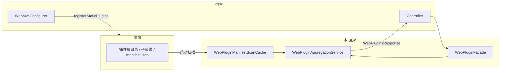

# plugin-web-starter

## 定位

面向 **Spring / Spring Boot 宿主** 的 **SDK（普通 JAR）**：

- 在启动时扫描磁盘上的 Web 插件目录，解析清单并 **缓存**（`WebPluginManifestScanCache`）。
- 请求时由 **`WebPluginAggregationService`** 生成 **`WebPluginsResponse`**（拼接 `publicBase`、白名单、版本合并、截断等），**不每次扫盘**。
- **不提供** `main`、**不注册** 任何 REST 或静态资源；宿主自行写 Controller / `WebMvcConfigurer`，通过 **`WebPluginFacade`** 与 **`WebPluginWebRegistration`** 对接。

---

## 为什么没有根目录的 `application.yml`？

Spring Boot 会自动加载 **classpath 根下** 的 `application.yml` / `application.properties`（各依赖 JAR 合并）。若本 SDK 仍带一份 `application.yml`，容易出现：

- 与宿主的 `server.port`、数据源、日志等 **意外覆盖或合并顺序难控**；
- 在 JAR 内放一份「会合并进宿主」的 `application.yml` 易与宿主配置冲突；代码默认值已偏向 `plugins/web`（候选路径仍含 `plugin-example-case/plugins/web` 以兼容旧示例布局）。

因此 **本模块不在 `src/main/resources/application.yml` 提供默认配置**；改为在 JAR 内提供 **示例文件**（见下），由宿主 **显式复制** 或 `spring.config.import` 引用。

**示例配置位置（不会被 Boot 自动加载）：**

`src/main/resources/META-INF/example/web-plugin-application.example.yml`  
打包后：`classpath:META-INF/example/web-plugin-application.example.yml`

宿主可选：

```yaml
# 宿主 application.yml
spring:
  config:
    import: optional:classpath:META-INF/example/web-plugin-application.example.yml
```

或直接将内容合并进自己的 `application.yml`。

---

## 模块结构（包一览）

| 包 / 类 | 职责 |
|---------|------|
| `api.WebPluginFacade` | 宿主主入口：清单 DTO、`publicBase` 解析、刷新缓存 |
| `api.WebPluginWebRegistration` | 静态资源映射、CORS 注册的静态辅助方法 |
| `config.WebPluginProperties` | `web-plugin.*` 绑定与 `validate()` |
| `config.WebPluginsPathResolver` | 解析磁盘上插件根目录 |
| `config.WebPluginStartupDiagnostics` | 启动时目录与白名单告警 |
| `service.WebPluginManifestScanCache` | 启动扫盘 + `refresh()` |
| `service.WebPluginAggregationService` | 按请求组装响应 |
| `service.WebPluginUrlValidator` | 生成的 entry / 样式绝对 URL 的 http(s) 主机白名单校验 |
| `service.WebPluginDisabledIdsReader` | 可选读取主应用目录下 `plugin-disabled.json` 中的后端插件 ID |
| `service.PluginVersionOrder` / `PluginRelativePaths` | 版本合并比较、manifest 相对路径安全 |
| `dto.*` | JSON 响应与描述模型 |

### 命名说明（准确性与兼容性）

| 现象 | 说明 |
|------|------|
| Maven 坐标 **`plugin-web-starter`** | 当前产物为 **库 JAR**，无独立 Web 启动。 |
| 配置顶层前缀 **`web-plugin`** | 与 `WebPluginProperties` / 包名对齐；若你仍使用旧前缀 `frontend-plugin:`，请整体改名为 `web-plugin:`（子键不变）。 |
| 配置键 **`web-plugin.entry-url-host-allowlist`** | 实际约束 **entryUrl 与 stylesheet** 两类 URL 的 host；叶子键名未改，顶层前缀为 `web-plugin`。 |
| 日志字段 **`skipped_entryUrlHostAllowlist`** | 原 `skipped_entryAllowlist` 易误解为仅 entry；新名称与变量一致（若你依赖旧日志 grep，需更新规则）。 |
| Java 包 **`io.github.xtemplus.webplugin`** | 本 SDK 源码包名；Maven 构件为 `plugin-web-starter`。 |

---

## 数据流（简图）



---

## Maven 依赖

```xml
<dependency>
    <groupId>io.github.xtemplus</groupId>
    <artifactId>plugin-web-starter</artifactId>
    <version>${revision}</version>
</dependency>
```

**传递依赖说明（本 SDK 刻意瘦身）：**

| 依赖 | 作用 |
|------|------|
| `spring-boot-starter-json` | `ObjectMapper`、`@ConfigurationProperties` 等 |
| `spring-webmvc` | `ResourceHandlerRegistry` / `CorsRegistry` 类型 |
| `javax.servlet-api`（**provided**） | 仅编译期；**运行由宿主**（如 `spring-boot-starter-web`）提供 Servlet |

---

## 宿主接入清单

1. **`@ComponentScan("io.github.xtemplus.webplugin")`**（或缩小到 `config`、`service`、`api`）。  
   **`WebPluginProperties` 已标注 `@Component`**，随包扫描即可绑定 `web-plugin.*`，**不必**再写 `@ConfigurationPropertiesScan` / `@EnableConfigurationProperties`（除非宿主刻意只注册配置、不扫本包）。
2. 配置 **`web-plugin.*`**（从示例文件复制或 `spring.config.import`）。
3. **Controller**：注入 **`WebPluginFacade`**，例如 `return facade.listPluginsForRequest(request);`
4. **`WebMvcConfigurer`**：按需调用  
   `WebPluginWebRegistration.registerStaticPlugins(registry, pathResolver, properties)`  
   `WebPluginWebRegistration.registerListApiCors(registry, properties)`
5. 热更新清单：`facade.refreshManifestCache()`。

### 最小宿主代码示意

```java
@RestController
public class HostPluginController {

    private final WebPluginFacade webPlugins;

    public HostPluginController(WebPluginFacade webPlugins) {
        this.webPlugins = webPlugins;
    }

    @GetMapping("/api/frontend-plugins")
    public WebPluginsResponse list(HttpServletRequest request) {
        return webPlugins.listPluginsForRequest(request);
    }
}
```

```java
@Configuration
public class HostWebConfig implements WebMvcConfigurer {

    private final WebPluginsPathResolver pathResolver;
    private final WebPluginProperties props;

    public HostWebConfig(WebPluginsPathResolver pathResolver, WebPluginProperties props) {
        this.pathResolver = pathResolver;
        this.props = props;
    }

    @Override
    public void addResourceHandlers(ResourceHandlerRegistry registry) {
        WebPluginWebRegistration.registerStaticPlugins(registry, pathResolver, props);
    }

    @Override
    public void addCorsMappings(CorsRegistry registry) {
        WebPluginWebRegistration.registerListApiCors(registry, props);
    }
}
```

（路径需与 `list-plugins-api-path`、宿主 Controller 映射一致。）

---

## 配置项一览

| 键 | 说明 |
|----|------|
| `web-plugins-dir` | 插件根目录 |
| `web-plugins-dir-resolution-fallback` | 解析用回退相对路径 |
| `plugins-web-path-prefix` | URL 与静态资源前缀 |
| `path-resolution-candidate-relative-paths` | 磁盘根候选相对路径列表 |
| `manifest-file-name` / `disabled-state-file-name` | 清单与禁用文件名 |
| `list-plugins-api-path` | 与 CORS 辅助方法、宿主路由对齐 |
| `host-plugin-api-version` | 响应字段 |
| `public-base-url` | 非空则固定为资源 URL 前缀 |
| `entry-url-host-allowlist` | entryUrl **与** 样式 URL 的 host 白名单（配置键名未改） |
| `max-plugins` / `max-plugins-min` / `max-plugins-max` | 数量与校验区间 |
| `main-app-workdir` / `main-app-plugins-subdir` | 可选禁用列表 |
| `cors-allowed-origins` | `registerListApiCors` 使用 |

非法值在 **`WebPluginProperties#afterPropertiesSet`** → **`validate()`** 抛出 **`IllegalStateException`**。

IDE 可识别配置键：本模块使用 **`spring-boot-configuration-processor`**（`optional`）生成元数据。

---

## 行为摘要

- **版本合并**：`PluginVersionOrder`（数值段 + 预发布规则）。
- **路径安全**：manifest 中 `entry` / `styles` 禁止 `..` 与绝对路径（`PluginRelativePaths`）。
- **日志**：SLF4J；启动 `manifest_scan`，请求 `request_summary`。

---

## 构建

```bash
mvn -pl plugin-web-starter package
```

产物为 **普通 JAR**（非 `spring-boot` 可执行 repackage）。
